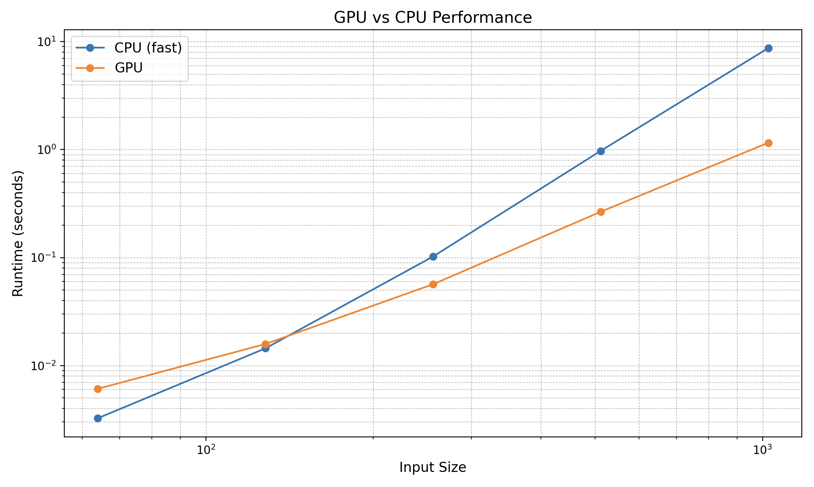

# MiniTorch Module 3


* Docs: https://minitorch.github.io/

* Overview: https://minitorch.github.io/module3.html


You will need to modify `tensor_functions.py` slightly in this assignment.

* Tests:

```
python run_tests.py
```

* Note:

Several of the tests for this assignment will only run if you are on a GPU machine and will not
run on github's test infrastructure. Please follow the instructions to setup up a colab machine
to run these tests.

This assignment requires the following files from the previous assignments. You can get these by running

```bash
python sync_previous_module.py previous-module-dir current-module-dir
```

The files that will be synced are:

        minitorch/tensor_data.py minitorch/tensor_functions.py minitorch/tensor_ops.py minitorch/operators.py minitorch/scalar.py minitorch/scalar_functions.py minitorch/module.py minitorch/autodiff.py minitorch/module.py project/run_manual.py project/run_scalar.py project/run_tensor.py minitorch/operators.py minitorch/module.py minitorch/autodiff.py minitorch/tensor.py minitorch/datasets.py minitorch/testing.py minitorch/optim.py

# Parallel Check
```MAP
 
================================================================================
 Parallel Accelerator Optimizing:  Function tensor_map.<locals>._map, 
/Users/kaushikkorlapati/workspace/mod3-kaushikkorlapati/minitorch/fast_ops.py 
(163)  
================================================================================


Parallel loop listing for  Function tensor_map.<locals>._map, /Users/kaushikkorlapati/workspace/mod3-kaushikkorlapati/minitorch/fast_ops.py (163) 
--------------------------------------------------------------------------------------|loop #ID
    def _map(                                                                         | 
        out: Storage,                                                                 | 
        out_shape: Shape,                                                             | 
        out_strides: Strides,                                                         | 
        in_storage: Storage,                                                          | 
        in_shape: Shape,                                                              | 
        in_strides: Strides,                                                          | 
    ) -> None:                                                                        | 
        if (out_strides == in_strides).all() and (out_shape == in_shape).all():-------| #0, 1
            for i in prange(len(out)):------------------------------------------------| #2
                out[i] = fn(in_storage[i])                                            | 
        else:                                                                         | 
            for i in prange(len(out)):------------------------------------------------| #3
                out_index = np.empty(len(out_shape), dtype=np.int32)                  | 
                in_index = np.empty(len(in_shape), dtype=np.int32)                    | 
                to_index(i, out_shape, out_index)                                     | 
                broadcast_index(out_index, out_shape, in_shape, in_index)             | 
                in_pos = index_to_position(in_index, in_strides)                      | 
                out_pos = index_to_position(out_index, out_strides)                   | 
                out[out_pos] = fn(in_storage[in_pos])                                 | 
--------------------------------- Fusing loops ---------------------------------
Attempting fusion of parallel loops (combines loops with similar properties)...
Following the attempted fusion of parallel for-loops there are 4 parallel for-
loop(s) (originating from loops labelled: #0, #1, #2, #3).
--------------------------------------------------------------------------------
----------------------------- Before Optimisation ------------------------------
--------------------------------------------------------------------------------
------------------------------ After Optimisation ------------------------------
Parallel structure is already optimal.
--------------------------------------------------------------------------------
--------------------------------------------------------------------------------
 
---------------------------Loop invariant code motion---------------------------
Allocation hoisting:
The memory allocation derived from the instruction at 
/Users/kaushikkorlapati/workspace/mod3-kaushikkorlapati/minitorch/fast_ops.py 
(176) is hoisted out of the parallel loop labelled #3 (it will be performed 
before the loop is executed and reused inside the loop):
   Allocation:: out_index = np.empty(len(out_shape), dtype=np.int32)
    - numpy.empty() is used for the allocation.
The memory allocation derived from the instruction at 
/Users/kaushikkorlapati/workspace/mod3-kaushikkorlapati/minitorch/fast_ops.py 
(177) is hoisted out of the parallel loop labelled #3 (it will be performed 
before the loop is executed and reused inside the loop):
   Allocation:: in_index = np.empty(len(in_shape), dtype=np.int32)
    - numpy.empty() is used for the allocation.
None
ZIP
 
================================================================================
 Parallel Accelerator Optimizing:  Function tensor_zip.<locals>._zip, 
/Users/kaushikkorlapati/workspace/mod3-kaushikkorlapati/minitorch/fast_ops.py 
(210)  
================================================================================


Parallel loop listing for  Function tensor_zip.<locals>._zip, /Users/kaushikkorlapati/workspace/mod3-kaushikkorlapati/minitorch/fast_ops.py (210) 
---------------------------------------------------------------------------|loop #ID
    def _zip(                                                              | 
        out: Storage,                                                      | 
        out_shape: Shape,                                                  | 
        out_strides: Strides,                                              | 
        a_storage: Storage,                                                | 
        a_shape: Shape,                                                    | 
        a_strides: Strides,                                                | 
        b_storage: Storage,                                                | 
        b_shape: Shape,                                                    | 
        b_strides: Strides,                                                | 
    ) -> None:                                                             | 
        if (                                                               | 
            np.array_equal(out_strides, a_strides)                         | 
            and np.array_equal(out_strides, b_strides)                     | 
            and np.array_equal(out_shape, a_shape)                         | 
            and np.array_equal(out_shape, b_shape)                         | 
        ):                                                                 | 
            for i in prange(len(out)):-------------------------------------| #4
                out[i] = fn(a_storage[i], b_storage[i])                    | 
        else:                                                              | 
            for i in prange(len(out)):-------------------------------------| #5
                out_index = np.empty(len(out_shape), dtype=np.int32)       | 
                a_index = np.empty(len(a_shape), dtype=np.int32)           | 
                b_index = np.empty(len(b_shape), dtype=np.int32)           | 
                to_index(i, out_shape, out_index)                          | 
                out_pos = index_to_position(out_index, out_strides)        | 
                broadcast_index(out_index, out_shape, a_shape, a_index)    | 
                a_pos = index_to_position(a_index, a_strides)              | 
                broadcast_index(out_index, out_shape, b_shape, b_index)    | 
                b_pos = index_to_position(b_index, b_strides)              | 
                out[out_pos] = fn(a_storage[a_pos], b_storage[b_pos])      | 
--------------------------------- Fusing loops ---------------------------------
Attempting fusion of parallel loops (combines loops with similar properties)...
Following the attempted fusion of parallel for-loops there are 2 parallel for-
loop(s) (originating from loops labelled: #4, #5).
--------------------------------------------------------------------------------
----------------------------- Before Optimisation ------------------------------
--------------------------------------------------------------------------------
------------------------------ After Optimisation ------------------------------
Parallel structure is already optimal.
--------------------------------------------------------------------------------
--------------------------------------------------------------------------------
 
---------------------------Loop invariant code motion---------------------------
Allocation hoisting:
The memory allocation derived from the instruction at 
/Users/kaushikkorlapati/workspace/mod3-kaushikkorlapati/minitorch/fast_ops.py 
(231) is hoisted out of the parallel loop labelled #5 (it will be performed 
before the loop is executed and reused inside the loop):
   Allocation:: out_index = np.empty(len(out_shape), dtype=np.int32)
    - numpy.empty() is used for the allocation.
The memory allocation derived from the instruction at 
/Users/kaushikkorlapati/workspace/mod3-kaushikkorlapati/minitorch/fast_ops.py 
(232) is hoisted out of the parallel loop labelled #5 (it will be performed 
before the loop is executed and reused inside the loop):
   Allocation:: a_index = np.empty(len(a_shape), dtype=np.int32)
    - numpy.empty() is used for the allocation.
The memory allocation derived from the instruction at 
/Users/kaushikkorlapati/workspace/mod3-kaushikkorlapati/minitorch/fast_ops.py 
(233) is hoisted out of the parallel loop labelled #5 (it will be performed 
before the loop is executed and reused inside the loop):
   Allocation:: b_index = np.empty(len(b_shape), dtype=np.int32)
    - numpy.empty() is used for the allocation.
None
REDUCE
 
================================================================================
 Parallel Accelerator Optimizing:  Function tensor_reduce.<locals>._reduce, 
/Users/kaushikkorlapati/workspace/mod3-kaushikkorlapati/minitorch/fast_ops.py 
(266)  
================================================================================


Parallel loop listing for  Function tensor_reduce.<locals>._reduce, /Users/kaushikkorlapati/workspace/mod3-kaushikkorlapati/minitorch/fast_ops.py (266) 
----------------------------------------------------------------------------------------|loop #ID
    def _reduce(                                                                        | 
        out: Storage,                                                                   | 
        out_shape: Shape,                                                               | 
        out_strides: Strides,                                                           | 
        a_storage: Storage,                                                             | 
        a_shape: Shape,                                                                 | 
        a_strides: Strides,                                                             | 
        reduce_dim: int,                                                                | 
    ) -> None:                                                                          | 
        new_size = a_shape[reduce_dim]                                                  | 
        new_stride = a_strides[reduce_dim]                                              | 
        for i in prange(len(out)):------------------------------------------------------| #6
            out_index = np.empty(len(out_shape), dtype=np.int32)                        | 
            to_index(i, out_shape, out_index)                                           | 
            out_index[reduce_dim] = 0                                                   | 
            a_pos = index_to_position(out_index, a_strides)                             | 
            for j in range(new_size):                                                   | 
                out[index_to_position(out_index, out_strides)] = fn(                    | 
                    out[index_to_position(out_index, out_strides)], a_storage[a_pos]    | 
                )                                                                       | 
                a_pos += new_stride                                                     | 
--------------------------------- Fusing loops ---------------------------------
Attempting fusion of parallel loops (combines loops with similar properties)...
Following the attempted fusion of parallel for-loops there are 1 parallel for-
loop(s) (originating from loops labelled: #6).
--------------------------------------------------------------------------------
----------------------------- Before Optimisation ------------------------------
--------------------------------------------------------------------------------
------------------------------ After Optimisation ------------------------------
Parallel structure is already optimal.
--------------------------------------------------------------------------------
--------------------------------------------------------------------------------
 
---------------------------Loop invariant code motion---------------------------
Allocation hoisting:
The memory allocation derived from the instruction at 
/Users/kaushikkorlapati/workspace/mod3-kaushikkorlapati/minitorch/fast_ops.py 
(278) is hoisted out of the parallel loop labelled #6 (it will be performed 
before the loop is executed and reused inside the loop):
   Allocation:: out_index = np.empty(len(out_shape), dtype=np.int32)
    - numpy.empty() is used for the allocation.
None
MATRIX MULTIPLY
 
================================================================================
 Parallel Accelerator Optimizing:  Function _tensor_matrix_multiply, 
/Users/kaushikkorlapati/workspace/mod3-kaushikkorlapati/minitorch/fast_ops.py 
(291)  
================================================================================


Parallel loop listing for  Function _tensor_matrix_multiply, /Users/kaushikkorlapati/workspace/mod3-kaushikkorlapati/minitorch/fast_ops.py (291) 
-----------------------------------------------------------------------------------------|loop #ID
def _tensor_matrix_multiply(                                                             | 
    out: Storage,                                                                        | 
    out_shape: Shape,                                                                    | 
    out_strides: Strides,                                                                | 
    a_storage: Storage,                                                                  | 
    a_shape: Shape,                                                                      | 
    a_strides: Strides,                                                                  | 
    b_storage: Storage,                                                                  | 
    b_shape: Shape,                                                                      | 
    b_strides: Strides,                                                                  | 
) -> None:                                                                               | 
    """NUMBA tensor matrix multiply function.                                            | 
                                                                                         | 
    Should work for any tensor shapes that broadcast as long as                          | 
                                                                                         | 
    ```                                                                                  | 
    assert a_shape[-1] == b_shape[-2]                                                    | 
    ```                                                                                  | 
                                                                                         | 
    Optimizations:                                                                       | 
                                                                                         | 
    * Outer loop in parallel                                                             | 
    * No index buffers or function calls                                                 | 
    * Inner loop should have no global writes, 1 multiply.                               | 
                                                                                         | 
                                                                                         | 
    Args:                                                                                | 
    ----                                                                                 | 
        out (Storage): storage for `out` tensor                                          | 
        out_shape (Shape): shape for `out` tensor                                        | 
        out_strides (Strides): strides for `out` tensor                                  | 
        a_storage (Storage): storage for `a` tensor                                      | 
        a_shape (Shape): shape for `a` tensor                                            | 
        a_strides (Strides): strides for `a` tensor                                      | 
        b_storage (Storage): storage for `b` tensor                                      | 
        b_shape (Shape): shape for `b` tensor                                            | 
        b_strides (Strides): strides for `b` tensor                                      | 
                                                                                         | 
    Returns:                                                                             | 
    -------                                                                              | 
        None : Fills in `out`                                                            | 
                                                                                         | 
    """                                                                                  | 
    a_batch_stride = a_strides[0] if a_shape[0] > 1 else 0                               | 
    b_batch_stride = b_strides[0] if b_shape[0] > 1 else 0                               | 
                                                                                         | 
    # TODO: Implement for Task 3.2.                                                      | 
    shared = a_shape[-1]                                                                 | 
    out_size = len(out)                                                                  | 
                                                                                         | 
    for l in prange(out_size):-----------------------------------------------------------| #7
        i = (l // out_shape[2]) % out_shape[1]                                           | 
        j = l % out_shape[2]                                                             | 
                                                                                         | 
        n = l // (out_shape[1] * out_shape[2])                                           | 
                                                                                         | 
        result = 0.0                                                                     | 
        out_pos = n * out_strides[0] + i * out_strides[1] + j * out_strides[2]           | 
        for k in range(shared):                                                          | 
            result += (                                                                  | 
                a_storage[n * a_batch_stride + i * a_strides[1] + k * a_strides[2]]      | 
                * b_storage[n * b_batch_stride + k * b_strides[1] + j * b_strides[2]]    | 
            )                                                                            | 
        out[out_pos] = result                                                            | 
--------------------------------- Fusing loops ---------------------------------
Attempting fusion of parallel loops (combines loops with similar properties)...
Following the attempted fusion of parallel for-loops there are 1 parallel for-
loop(s) (originating from loops labelled: #7).
--------------------------------------------------------------------------------
----------------------------- Before Optimisation ------------------------------
--------------------------------------------------------------------------------
------------------------------ After Optimisation ------------------------------
Parallel structure is already optimal.
--------------------------------------------------------------------------------
--------------------------------------------------------------------------------
 
---------------------------Loop invariant code motion---------------------------
Allocation hoisting:
No allocation hoisting found
None
```

# Benchmarking CPU VS GPU


# Training
### Split, GPU
```
Epoch  0  loss  5.706236482866451 correct 37 epoch time 0 s
Epoch  10  loss  4.427626938293522 correct 40 epoch time 13.307547807693481 s
Epoch  20  loss  3.841515521779433 correct 46 epoch time 12.120750188827515 s
Epoch  30  loss  2.852264125922991 correct 44 epoch time 12.114638328552246 s
Epoch  40  loss  1.7312103739622648 correct 46 epoch time 12.041292428970337 s
Epoch  50  loss  3.304006555262581 correct 44 epoch time 12.081193923950195 s
Epoch  60  loss  2.7042534836252257 correct 46 epoch time 12.06630825996399 s
Epoch  70  loss  3.801925538122066 correct 48 epoch time 12.103878021240234 s
Epoch  80  loss  1.6050654384382548 correct 49 epoch time 12.162076234817505 s
Epoch  90  loss  0.9883635224157817 correct 45 epoch time 12.168766260147095 s
Epoch  100  loss  1.579400946510156 correct 49 epoch time 12.08600664138794 s
Epoch  110  loss  1.5190648432100162 correct 50 epoch time 12.265182256698608 s
Epoch  120  loss  1.246935193494012 correct 49 epoch time 12.100367307662964 s
Epoch  130  loss  0.4294907206834814 correct 50 epoch time 12.093090295791626 s
Epoch  140  loss  0.32087709177497664 correct 49 epoch time 12.05166745185852 s
Epoch  150  loss  0.2685780763112516 correct 50 epoch time 12.183539152145386 s
Epoch  160  loss  0.9546317394425908 correct 50 epoch time 12.105521440505981 s
Epoch  170  loss  1.0424300532538093 correct 50 epoch time 11.970643281936646 s
Epoch  180  loss  0.341192459425038 correct 50 epoch time 12.148948669433594 s
Epoch  190  loss  0.4076056883877813 correct 50 epoch time 12.118953227996826 s
Epoch  200  loss  0.49209809311572716 correct 50 epoch time 12.027171850204468 s
Epoch  210  loss  0.6461521337249339 correct 50 epoch time 12.085257053375244 s
Epoch  220  loss  0.44674118072417074 correct 49 epoch time 11.868714332580566 s
Epoch  230  loss  0.8853695800248144 correct 50 epoch time 11.8999764919281 s
Epoch  240  loss  0.3223715761466266 correct 50 epoch time 11.871196746826172 s
Epoch  250  loss  0.404209196001514 correct 50 epoch time 12.06489086151123 s
```
### Split, CPU
```
Epoch  0  loss  8.181905434505705 correct 26 epoch time 0 s
Epoch  10  loss  4.559009185056569 correct 41 epoch time 0.7435309886932373 s
Epoch  20  loss  4.972942976572974 correct 44 epoch time 0.739741325378418 s
Epoch  30  loss  7.01030370099774 correct 44 epoch time 0.7332568168640137 s
Epoch  40  loss  4.707166350091962 correct 46 epoch time 0.7392289638519287 s
Epoch  50  loss  4.260180989619509 correct 46 epoch time 0.7364799976348877 s
Epoch  60  loss  1.4351408387359763 correct 47 epoch time 0.7446000576019287 s
Epoch  70  loss  1.8312700396660246 correct 46 epoch time 0.7392809391021729 s
Epoch  80  loss  1.5458896994407951 correct 46 epoch time 0.742163896560669 s
Epoch  90  loss  4.116499080335458 correct 47 epoch time 0.7370481491088867 s
Epoch  100  loss  1.1154076443120244 correct 48 epoch time 0.7374160289764404 s
Epoch  110  loss  1.347682210585146 correct 46 epoch time 0.7354469299316406 s
Epoch  120  loss  0.7796155947189998 correct 48 epoch time 0.7345871925354004 s
Epoch  130  loss  1.166148440077812 correct 48 epoch time 0.7332229614257812 s
Epoch  140  loss  1.329104512142133 correct 47 epoch time 0.7334578037261963 s
Epoch  150  loss  2.0924854791137486 correct 49 epoch time 0.7468380928039551 s
Epoch  160  loss  0.9635401590427872 correct 49 epoch time 0.7360780239105225 s
Epoch  170  loss  0.517981333964711 correct 47 epoch time 0.7336390018463135 s
Epoch  180  loss  4.349557114276489 correct 44 epoch time 0.7352919578552246 s
Epoch  190  loss  1.3286114848207857 correct 49 epoch time 0.7348639965057373 s
Epoch  200  loss  0.9855264323010274 correct 49 epoch time 0.7322711944580078 s
Epoch  210  loss  0.9220865940168931 correct 49 epoch time 0.7311418056488037 s
Epoch  220  loss  0.7306323285880068 correct 49 epoch time 0.7786500453948975 s
Epoch  230  loss  1.1214489678993858 correct 49 epoch time 0.7367608547210693 s
Epoch  240  loss  2.5063177682365176 correct 50 epoch time 0.7359342575073242 s
```
### XOR, GPU
```
Epoch  0  loss  6.92868161361976 correct 30 epoch time 0 s
Epoch  10  loss  2.830050025886187 correct 34 epoch time 12.966995477676392 s
Epoch  20  loss  4.217035188765025 correct 44 epoch time 12.057184219360352 s
Epoch  30  loss  2.792186375310609 correct 45 epoch time 12.167280912399292 s
Epoch  40  loss  3.598829489209402 correct 46 epoch time 11.94653868675232 s
Epoch  50  loss  2.9631355241563258 correct 45 epoch time 12.042218685150146 s
Epoch  60  loss  1.2345243428633832 correct 46 epoch time 12.057584047317505 s
Epoch  70  loss  2.3895898193813943 correct 48 epoch time 11.969070196151733 s
Epoch  80  loss  2.980160978394052 correct 46 epoch time 11.985990285873413 s
Epoch  90  loss  1.87412009670612 correct 46 epoch time 12.003015041351318 s
Epoch  100  loss  1.6437782700802641 correct 48 epoch time 11.96924376487732 s
Epoch  110  loss  1.9533548438846324 correct 47 epoch time 11.955658197402954 s
Epoch  120  loss  1.3186094614739672 correct 48 epoch time 11.973060369491577 s
Epoch  130  loss  1.3239370632826146 correct 48 epoch time 12.004647731781006 s
Epoch  140  loss  2.3169221061249967 correct 47 epoch time 11.90724778175354 s
Epoch  150  loss  3.088318308464046 correct 45 epoch time 12.0306875705719 s
Epoch  160  loss  1.2406143382065227 correct 47 epoch time 11.94117021560669 s
Epoch  170  loss  1.4221137576886174 correct 48 epoch time 11.838222742080688 s
Epoch  180  loss  0.7675711098408537 correct 48 epoch time 11.852007150650024 s
Epoch  190  loss  1.3131284245354717 correct 48 epoch time 11.807550191879272 s
Epoch  200  loss  2.0741536174169526 correct 48 epoch time 11.765824317932129 s
Epoch  210  loss  0.7779231387654184 correct 49 epoch time 13.051491498947144 s
Epoch  220  loss  1.9782070910068141 correct 48 epoch time 11.8840012550354 s
Epoch  230  loss  0.9223399846732823 correct 50 epoch time 11.963410139083862 s
Epoch  240  loss  1.1415895290784923 correct 50 epoch time 11.930877208709717 s
```
### XOR, CPU
```
Epoch  0  loss  8.928739660935348 correct 31 epoch time 0 s
Epoch  10  loss  5.85793818261176 correct 42 epoch time 0.7343738079071045 s
Epoch  20  loss  4.858857050290453 correct 43 epoch time 0.7567970752716064 s
Epoch  30  loss  2.684043554686597 correct 42 epoch time 0.7428691387176514 s
Epoch  40  loss  2.66258822206964 correct 47 epoch time 0.7390878200531006 s
Epoch  50  loss  1.707792977125039 correct 43 epoch time 0.7642219066619873 s
Epoch  60  loss  3.184200118446406 correct 43 epoch time 0.739915132522583 s
Epoch  70  loss  2.3635535011752853 correct 46 epoch time 0.7345120906829834 s
Epoch  80  loss  2.523417272404094 correct 46 epoch time 0.7205579280853271 s
Epoch  90  loss  4.991594934353678 correct 46 epoch time 0.7534050941467285 s
Epoch  100  loss  1.736414446590257 correct 46 epoch time 0.7308878898620605 s
Epoch  110  loss  1.8563959440788764 correct 46 epoch time 0.7342519760131836 s
Epoch  120  loss  2.40002909961156 correct 47 epoch time 0.7303061485290527 s
Epoch  130  loss  2.1689546602907512 correct 47 epoch time 0.7365448474884033 s
Epoch  140  loss  1.3109260042507205 correct 47 epoch time 0.7602860927581787 s
Epoch  150  loss  1.4406753310270894 correct 45 epoch time 0.7366237640380859 s
Epoch  160  loss  2.223658895436792 correct 48 epoch time 0.731917142868042 s
Epoch  170  loss  1.4874150440446183 correct 50 epoch time 0.7675180435180664 s
Epoch  180  loss  1.756038375304822 correct 49 epoch time 0.7703249454498291 s
Epoch  190  loss  0.981502723364382 correct 50 epoch time 0.738429069519043 s
Epoch  200  loss  1.207671343442175 correct 49 epoch time 0.72890305519104 s
Epoch  210  loss  1.359403200393774 correct 50 epoch time 0.7362449169158936 s
Epoch  220  loss  1.0555398475850708 correct 50 epoch time 0.7443499565124512 s
Epoch  230  loss  0.8186598426853438 correct 50 epoch time 0.7330830097198486 s
Epoch  240  loss  0.24733656205753052 correct 50 epoch time 0.7327971458435059 s
```
### Simple, GPU
```
Epoch  0  loss  3.5087839525383053 correct 47 epoch time 0 s
Epoch  10  loss  1.0212509947978705 correct 50 epoch time 12.030852317810059 s
Epoch  20  loss  0.17344532834999007 correct 50 epoch time 12.056978225708008 s
Epoch  30  loss  0.41884523572573823 correct 50 epoch time 12.099266290664673 s
Epoch  40  loss  0.45810296060868266 correct 50 epoch time 12.051109313964844 s
Epoch  50  loss  0.060520842367272565 correct 50 epoch time 12.087776184082031 s
Epoch  60  loss  0.3186106487989825 correct 50 epoch time 12.166447162628174 s
Epoch  70  loss  0.1891637866844005 correct 50 epoch time 11.992002010345459 s
Epoch  80  loss  0.20663364174806464 correct 50 epoch time 11.954106092453003 s
Epoch  90  loss  0.14156716360646587 correct 50 epoch time 12.109859943389893 s
Epoch  100  loss  0.1432458513460841 correct 50 epoch time 12.036153078079224 s
Epoch  110  loss  0.09536944989464463 correct 50 epoch time 12.024205207824707 s
Epoch  120  loss  0.16863303438401217 correct 50 epoch time 12.117310285568237 s
Epoch  130  loss  0.05806278196376684 correct 50 epoch time 12.161317348480225 s
Epoch  140  loss  0.013436249684386888 correct 50 epoch time 12.047273635864258 s
Epoch  150  loss  0.02839112800602632 correct 50 epoch time 12.993552446365356 s
Epoch  160  loss  0.14014969362318944 correct 50 epoch time 12.131148338317871 s
Epoch  170  loss  0.18647555743079883 correct 50 epoch time 12.090752601623535 s
Epoch  180  loss  0.04334815333261948 correct 50 epoch time 12.099859952926636 s
Epoch  190  loss  0.10729204769639235 correct 50 epoch time 12.091298818588257 s
Epoch  200  loss  0.007450109961689421 correct 50 epoch time 12.037786960601807 s
Epoch  210  loss  0.003975204849127995 correct 50 epoch time 12.113883256912231 s
Epoch  220  loss  0.07407491998557868 correct 50 epoch time 12.161880731582642 s
Epoch  230  loss  0.09495975584868052 correct 50 epoch time 12.083121061325073 s
Epoch  240  loss  0.17493891899874436 correct 50 epoch time 12.022337913513184 s
```
### Simple, CPU
```
Epoch  0  loss  5.922465893035497 correct 47 epoch time 0 s
Epoch  10  loss  3.24404502665083 correct 48 epoch time 0.8137001991271973 s
Epoch  20  loss  1.736884133074927 correct 48 epoch time 0.7403850555419922 s
Epoch  30  loss  0.8629073979536208 correct 49 epoch time 0.8142409324645996 s
Epoch  40  loss  0.23921870760927288 correct 49 epoch time 0.7453019618988037 s
Epoch  50  loss  1.1410264546057394 correct 50 epoch time 0.7592039108276367 s
Epoch  60  loss  0.43922836884830146 correct 49 epoch time 0.733299970626831 s
Epoch  70  loss  0.8652963396960517 correct 50 epoch time 0.7459321022033691 s
Epoch  80  loss  1.3466905267843312 correct 50 epoch time 0.7462260723114014 s
Epoch  90  loss  0.8400119637366605 correct 50 epoch time 0.7650158405303955 s
Epoch  100  loss  0.5850127658516189 correct 50 epoch time 0.7449312210083008 s
Epoch  110  loss  0.6999809601023164 correct 50 epoch time 0.7493250370025635 s
Epoch  120  loss  1.0871667730296657 correct 50 epoch time 0.739264965057373 s
Epoch  130  loss  0.4366870237126828 correct 50 epoch time 0.7479307651519775 s
Epoch  140  loss  0.5895422083716377 correct 50 epoch time 0.7295291423797607 s
Epoch  150  loss  1.0083776516779377 correct 50 epoch time 0.7253580093383789 s
Epoch  160  loss  0.07022714976825704 correct 50 epoch time 0.7345490455627441 s
Epoch  170  loss  0.09244929751833565 correct 50 epoch time 0.7304348945617676 s
Epoch  180  loss  0.5818819072878412 correct 50 epoch time 0.7564022541046143 s
Epoch  190  loss  0.0881653887041051 correct 50 epoch time 0.7272417545318604 s
Epoch  200  loss  0.004996906880404721 correct 50 epoch time 0.7444329261779785 s
Epoch  210  loss  0.446626125155781 correct 50 epoch time 0.742311954498291 s
Epoch  220  loss  0.29349622081921106 correct 50 epoch time 0.7639691829681396 s
Epoch  230  loss  0.45736749920813546 correct 50 epoch time 0.738814115524292 s
Epoch  240  loss  0.49758938172980294 correct 50 epoch time 0.7315499782562256 s
```
# Training (Large)
### Split, GPU
```
Epoch  0  loss  9.008688513457354 correct 23 epoch time 0 s
Epoch  10  loss  3.64246090126385 correct 49 epoch time 12.803434371948242 s
Epoch  20  loss  1.7496277603257255 correct 49 epoch time 12.94964051246643 s
Epoch  30  loss  1.6922782648811054 correct 48 epoch time 12.977988719940186 s
Epoch  40  loss  1.2203414796078584 correct 49 epoch time 13.08315110206604 s
Epoch  50  loss  1.0840112152183614 correct 48 epoch time 13.82906198501587 s
Epoch  60  loss  1.3023861504460847 correct 50 epoch time 12.85834264755249 s
Epoch  70  loss  0.7406145963750934 correct 49 epoch time 12.77817702293396 s
Epoch  80  loss  1.1493735089577513 correct 50 epoch time 12.761256456375122 s
Epoch  90  loss  0.549779995077944 correct 49 epoch time 12.870378971099854 s
Epoch  100  loss  1.492251948968105 correct 50 epoch time 12.780605792999268 s
Epoch  110  loss  1.250602101219567 correct 50 epoch time 12.785552024841309 s
Epoch  120  loss  0.6143037959088783 correct 49 epoch time 12.795746088027954 s
Epoch  130  loss  0.6680895547296051 correct 50 epoch time 12.736661672592163 s
Epoch  140  loss  0.34377309826156255 correct 50 epoch time 12.722340822219849 s
Epoch  150  loss  0.3882534986117493 correct 50 epoch time 12.779606819152832 s
Epoch  160  loss  0.31181855383656254 correct 50 epoch time 12.764145612716675 s
Epoch  170  loss  0.8610361448695633 correct 50 epoch time 12.789870738983154 s
Epoch  180  loss  1.2809455367941465 correct 50 epoch time 12.788034439086914 s
Epoch  190  loss  0.1125254435633527 correct 50 epoch time 12.840145826339722 s
Epoch  200  loss  0.15785872755608474 correct 50 epoch time 12.609681367874146 s
Epoch  210  loss  0.30515353839198095 correct 50 epoch time 12.782158374786377 s
Epoch  220  loss  0.21713854820020603 correct 50 epoch time 13.689262866973877 s
Epoch  230  loss  0.24321041534388121 correct 50 epoch time 12.834744453430176 s
Epoch  240  loss  0.15949425502657633 correct 50 epoch time 12.806899785995483 s
```
### Split, CPU
```
Epoch  0  loss  7.728345917319499 correct 34 epoch time 0 s
Epoch  10  loss  7.586074820646691 correct 35 epoch time 1.1171300411224365 s
Epoch  20  loss  3.715108912200163 correct 46 epoch time 1.0435919761657715 s
Epoch  30  loss  3.3411431099729607 correct 47 epoch time 1.0733048915863037 s
Epoch  40  loss  2.1993335994139556 correct 47 epoch time 1.0450439453125 s
Epoch  50  loss  2.1244176722967083 correct 49 epoch time 1.045903205871582 s
Epoch  60  loss  1.3851339752467258 correct 49 epoch time 1.0208818912506104 s
Epoch  70  loss  2.1360363510896616 correct 50 epoch time 1.0229260921478271 s
Epoch  80  loss  1.6309580437487554 correct 49 epoch time 1.0859179496765137 s
Epoch  90  loss  1.4708293261886969 correct 50 epoch time 1.1032729148864746 s
Epoch  100  loss  1.3213700751798698 correct 46 epoch time 1.0553040504455566 s
Epoch  110  loss  2.0863839808260756 correct 49 epoch time 1.08418607711792 s
Epoch  120  loss  1.9858776564012133 correct 50 epoch time 1.0611069202423096 s
Epoch  130  loss  0.17549875823682798 correct 49 epoch time 1.0245311260223389 s
Epoch  140  loss  1.828223483492243 correct 49 epoch time 1.0555810928344727 s
Epoch  150  loss  0.47551546268944156 correct 49 epoch time 1.277343988418579 s
Epoch  160  loss  1.197672490875847 correct 49 epoch time 1.0821747779846191 s
Epoch  170  loss  1.626438056308547 correct 47 epoch time 1.0401742458343506 s
Epoch  180  loss  0.9592620122731531 correct 49 epoch time 1.0583748817443848 s
Epoch  190  loss  1.9519064112057372 correct 47 epoch time 1.0601410865783691 s
Epoch  200  loss  0.3988998313584234 correct 48 epoch time 1.0207910537719727 s
Epoch  210  loss  0.8383117693578298 correct 48 epoch time 1.0285627841949463 s
Epoch  220  loss  0.20467182158223995 correct 47 epoch time 1.02559494972229 s
Epoch  230  loss  0.6677478646205175 correct 50 epoch time 1.0628011226654053 s
Epoch  240  loss  1.9569247033944035 correct 47 epoch time 1.0287461280822754 s
```
### Xor, GPU
```
Epoch  0  loss  3.8658661906763268 correct 24 epoch time 0 s
Epoch  10  loss  5.2095593215106595 correct 41 epoch time 12.921333074569702 s
Epoch  20  loss  2.508428314578268 correct 46 epoch time 13.047126054763794 s
Epoch  30  loss  2.7186882056951287 correct 47 epoch time 13.082292079925537 s
Epoch  40  loss  1.845807018837248 correct 47 epoch time 12.963751792907715 s
Epoch  50  loss  1.7341622395278316 correct 49 epoch time 13.144290685653687 s
Epoch  60  loss  0.8014028335401447 correct 49 epoch time 12.91085171699524 s
Epoch  70  loss  2.0156091605529634 correct 50 epoch time 12.807454109191895 s
Epoch  80  loss  1.1924785868163843 correct 48 epoch time 12.80666446685791 s
Epoch  90  loss  1.6073327652135976 correct 50 epoch time 12.804884195327759 s
Epoch  100  loss  1.2693979742346093 correct 50 epoch time 13.82143783569336 s
Epoch  110  loss  0.9869252562294855 correct 50 epoch time 12.73146939277649 s
Epoch  120  loss  0.8971611998373544 correct 50 epoch time 12.80188775062561 s
Epoch  130  loss  0.8295111622964404 correct 50 epoch time 12.828057527542114 s
Epoch  140  loss  0.8254681686384341 correct 50 epoch time 12.770874738693237 s
Epoch  150  loss  1.0758997464631026 correct 50 epoch time 12.829100608825684 s
Epoch  160  loss  0.7551287320045519 correct 50 epoch time 12.881134510040283 s
Epoch  170  loss  0.9777573120786517 correct 50 epoch time 12.78714108467102 s
Epoch  180  loss  0.9871049445089406 correct 50 epoch time 12.807706117630005 s
Epoch  190  loss  0.929668240140091 correct 50 epoch time 12.914068937301636 s
Epoch  200  loss  0.82023317378558 correct 50 epoch time 12.754395484924316 s
Epoch  210  loss  0.3695937876654839 correct 50 epoch time 12.892482995986938 s
Epoch  220  loss  0.18909738525210157 correct 50 epoch time 12.903837442398071 s
Epoch  230  loss  0.07448885751089608 correct 50 epoch time 12.813367366790771 s
Epoch  240  loss  0.6335437420415192 correct 50 epoch time 12.854318857192993 s
```
### Xor, CPU
```
Epoch  0  loss  7.62412871418381 correct 35 epoch time 0 s
Epoch  10  loss  6.1559955331311444 correct 43 epoch time 1.0378351211547852 s
Epoch  20  loss  2.4630266609094345 correct 45 epoch time 1.0317707061767578 s
Epoch  30  loss  6.098827342102817 correct 46 epoch time 1.0346643924713135 s
Epoch  40  loss  4.135862213140966 correct 44 epoch time 1.0668318271636963 s
Epoch  50  loss  1.937082294632609 correct 46 epoch time 1.07871413230896 s
Epoch  60  loss  1.522562945973895 correct 46 epoch time 1.0374619960784912 s
Epoch  70  loss  2.90779378963404 correct 45 epoch time 1.0356049537658691 s
Epoch  80  loss  1.7504826190485878 correct 46 epoch time 1.0346908569335938 s
Epoch  90  loss  3.3389770173605022 correct 46 epoch time 1.0355370044708252 s
Epoch  100  loss  3.150885290662371 correct 46 epoch time 1.039863109588623 s
Epoch  110  loss  2.671847935783674 correct 45 epoch time 1.0374958515167236 s
Epoch  120  loss  2.177175641333572 correct 48 epoch time 1.0376482009887695 s
Epoch  130  loss  0.7228661556792794 correct 47 epoch time 1.0399417877197266 s
Epoch  140  loss  2.458631737656435 correct 48 epoch time 1.0430152416229248 s
Epoch  150  loss  2.1632261223061726 correct 48 epoch time 1.0411529541015625 s
Epoch  160  loss  0.863326877463463 correct 48 epoch time 1.043536901473999 s
Epoch  170  loss  2.7338332021189222 correct 49 epoch time 1.0408580303192139 s
Epoch  180  loss  2.241501480127608 correct 48 epoch time 1.0406179428100586 s
Epoch  190  loss  0.35036929013376905 correct 49 epoch time 1.0623021125793457 s
Epoch  200  loss  0.7730159486559846 correct 47 epoch time 1.0529847145080566 s
Epoch  210  loss  0.22183293781065205 correct 49 epoch time 1.0436170101165771 s
Epoch  220  loss  0.5279093189868882 correct 49 epoch time 1.0331292152404785 s
Epoch  230  loss  0.8036002022938713 correct 47 epoch time 1.0410881042480469 s
Epoch  240  loss  1.0455497410926888 correct 49 epoch time 1.0430808067321777 s
```
### Simple, GPU
```
Epoch  0  loss  2.1384706025790914 correct 46 epoch time 0 s
Epoch  10  loss  0.5590621331902426 correct 49 epoch time 12.973556995391846 s
Epoch  20  loss  0.6192216506589763 correct 50 epoch time 13.196425437927246 s
Epoch  30  loss  0.9632036530412431 correct 50 epoch time 14.002302169799805 s
Epoch  40  loss  0.10177851535079063 correct 50 epoch time 12.905505180358887 s
Epoch  50  loss  1.2429194829281198 correct 50 epoch time 13.173987865447998 s
Epoch  60  loss  0.05054263902336584 correct 50 epoch time 12.979779243469238 s
Epoch  70  loss  0.45355890696503537 correct 50 epoch time 12.977957487106323 s
Epoch  80  loss  0.10730413098896022 correct 50 epoch time 12.886119604110718 s
Epoch  90  loss  1.113901751782495 correct 50 epoch time 13.001066446304321 s
Epoch  100  loss  0.0003032922386144007 correct 50 epoch time 12.997146368026733 s
Epoch  110  loss  0.008089688140997845 correct 50 epoch time 13.142457723617554 s
Epoch  120  loss  0.007091354949701894 correct 50 epoch time 13.095510959625244 s
Epoch  130  loss  0.004782635019954444 correct 50 epoch time 13.18116545677185 s
Epoch  140  loss  0.011776475045698544 correct 50 epoch time 12.858421564102173 s
Epoch  150  loss  0.30507427385406455 correct 50 epoch time 12.993621826171875 s
Epoch  160  loss  0.2848260090207026 correct 50 epoch time 13.027882099151611 s
Epoch  170  loss  0.2141658470573137 correct 50 epoch time 12.852538108825684 s
Epoch  180  loss  0.026903035416109385 correct 50 epoch time 12.987990856170654 s
Epoch  190  loss  0.05685855603799867 correct 50 epoch time 12.988102674484253 s
Epoch  200  loss  0.021190311610792323 correct 50 epoch time 13.813293933868408 s
Epoch  210  loss  0.09432021624998846 correct 50 epoch time 13.023256540298462 s
Epoch  220  loss  0.12527109824187682 correct 50 epoch time 12.893369197845459 s
Epoch  230  loss  0.025580380315011392 correct 50 epoch time 12.960844039916992 s
Epoch  240  loss  0.0024011690278194346 correct 50 epoch time 12.824127435684204 s
```
### Simple, CPU
```
Epoch  0  loss  4.201342068400233 correct 49 epoch time 0 s
Epoch  10  loss  2.7626907067860054 correct 46 epoch time 1.0357749462127686 s
Epoch  20  loss  0.47644724195206123 correct 50 epoch time 1.09116792678833 s
Epoch  30  loss  1.0454051379136076 correct 49 epoch time 1.0686140060424805 s
Epoch  40  loss  1.2340039833731975 correct 48 epoch time 1.047433853149414 s
Epoch  50  loss  1.231729314245802 correct 50 epoch time 1.0160913467407227 s
Epoch  60  loss  0.617699962111495 correct 50 epoch time 1.1039810180664062 s
Epoch  70  loss  0.2061194090793354 correct 50 epoch time 1.163705825805664 s
Epoch  80  loss  0.3702883149146454 correct 50 epoch time 1.0799291133880615 s
Epoch  90  loss  0.1853321809973205 correct 50 epoch time 1.0583479404449463 s
Epoch  100  loss  0.1972927647213853 correct 50 epoch time 1.016084909439087 s
Epoch  110  loss  0.12157207395595407 correct 50 epoch time 1.0248279571533203 s
Epoch  120  loss  0.2327161262981525 correct 50 epoch time 1.049551248550415 s
Epoch  130  loss  0.07657839790076894 correct 50 epoch time 1.0284109115600586 s
Epoch  140  loss  0.3450023959257265 correct 50 epoch time 1.0214481353759766 s
Epoch  150  loss  0.1501403218605511 correct 50 epoch time 1.0408718585968018 s
Epoch  160  loss  0.10478548683667044 correct 50 epoch time 1.0350008010864258 s
Epoch  170  loss  0.24715393702538319 correct 50 epoch time 1.0342731475830078 s
Epoch  180  loss  0.556109964813069 correct 50 epoch time 1.0951740741729736 s
Epoch  190  loss  0.14139694867787658 correct 50 epoch time 1.035099983215332 s
Epoch  200  loss  0.02109481693669879 correct 50 epoch time 1.0254487991333008 s
Epoch  210  loss  0.13170996202802293 correct 50 epoch time 1.0638611316680908 s
Epoch  220  loss  0.23032720216830566 correct 50 epoch time 1.0314490795135498 s
Epoch  230  loss  0.17285795222963418 correct 50 epoch time 1.0825169086456299 s
Epoch  240  loss  0.1181269349587028 correct 50 epoch time 1.0597591400146484 s
```
